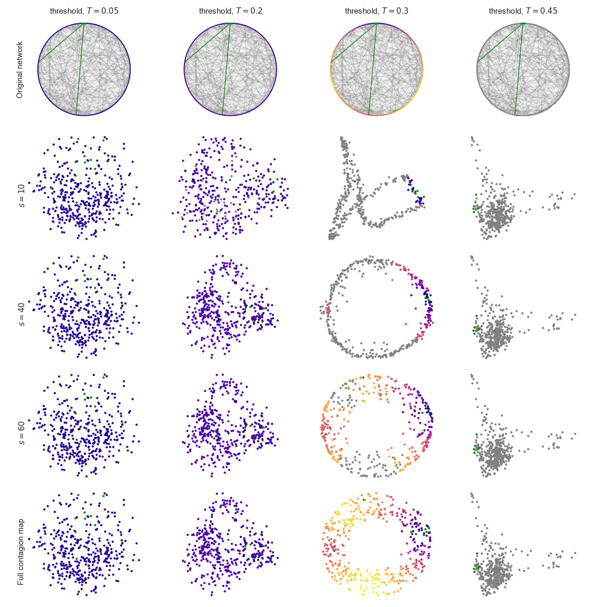

# contagionMap
Python library that allows the construction of contagion maps from network data.


This code accompanies the paper "Topological data analysis of truncated contagion maps" by Florian Klimm (2022).

This code also allows the construction of non-truncated contagion maps as originally introduced in

Taylor, D., Klimm, F., Harrington, H. A., Kramár, M., Mischaikow, K., Porter, M. A., & Mucha, P. J. (2015). Topological data analysis of contagion maps for examining spreading processes on networks. Nature Communications, 6(1), 1-11.




## Prerequisites
- Python (tested for 3.9.7)
- Some Python standard libraries (numpy,networkx,...)
### Optional
- [Ripser](https://github.com/Ripser/ripser) for the topological data analysis (persistent homology)
- [scanpy](https://github.com/theislab/scanpy) for the analysis of single-cell gene expression data

## How-to
The code enables
1. Construction of noisy geoemtric ring lattice networks
2. Computation of (truncated) contagion maps
3. Quantification of barcodes of these contagion maps with persistent homology

The simplest use case is
```Python
import cmap as conmap

# network construction
noisyRL = conmap.constructNoisyRingLattice(numberNodes=400,geometricDegree=6,nongeometricDegree=2)

# truncated contagion map
contagionMap_t03_truncated = conmap.runTruncatedContagionMap(noisyRL,threshold=0.3,numberSteps=20)

# compute ring stability with Ripser
ringStabilityTruncated = conmap.callRipser(contagionMap_t03_truncated)

# full contagion maps can be computed by setting the numberSteps parameter to infinity
contagionMap_t03_full= conmap.runTruncatedContagionMap(noisyRL,threshold=0.3,numberSteps=np.Inf)

# compute ring stability with Ripser
ringStabilityFull= conmap.callRipser(contagionMap_t03_full)

# for many noisy ring lattice networks the truncated contagion map yields a larger ring stability than the full contagion map. For details see the manuscript.

```

There is a small tutorial Jupyter Notebook in `/python/tutorial.ipynb` that compares a truncated with a full contagion map.

To reproduce the figures in the manuscript, see Jupyter notebooks in the folder `/python`.
